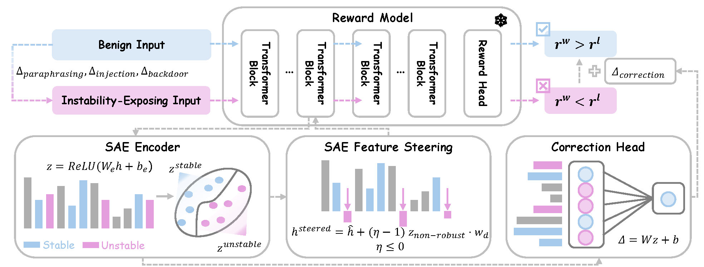

# Preference Instability in Reward Models: Detection and Mitigation via Sparse Autoencoders

This repository contains the official implementation of the paper. We introduce a framework for detecting and mitigating preference instability in reward models using Sparse Autoencoders (SAEs). The pipeline covers three stages: perturbation generation, SAE-based instability detection, and reward correction at inference time.

<p align="center">
  
</p>

---

## Table of Contents

1. [Environment Setup](#environment-setup)
2. [Pretrained Models and Datasets](#pretrained-models-and-datasets)
3. [Repository Structure](#repository-structure)
4. [Full Reproduction Pipeline](#full-reproduction-pipeline)
5. [Citation](#citation)

---

## Environment Setup

All experiments were run on NVIDIA A100 (40 GB) GPUs with Python 3.10 and CUDA 12.6. We recommend creating a dedicated conda environment using the provided `environment.yml`.

```bash
conda env create -f environment.yml
conda activate sae-rm
```

The default `environment.yml` targets CUDA 12.6. If your system uses a different CUDA version, edit the `--extra-index-url` line and the `torch` version tag in `environment.yml` before creating the environment. Supported options are listed as comments inside the file.

The SAE training and inference rely on [SAELens](https://github.com/jbloomAus/SAELens). Gradient-guided perturbation generation requires an OpenAI API key for GPT-4o calls.

---

## Pretrained Models and Datasets

### Downloading from Hugging Face

All perturbation datasets and pretrained SAE checkpoints are hosted on Hugging Face. Run the following to download everything at once.

```python
from huggingface_hub import snapshot_download

# Perturbation datasets
snapshot_download(
    repo_id="Shunchang/sae-rm-perturbation-data",
    repo_type="dataset",
    local_dir="./perturbation_results"
)

# Pretrained SAE checkpoints
snapshot_download(
    repo_id="Shunchang/sae-rm-checkpoints",
    repo_type="model",
    local_dir="./checkpoints"
)
```

After downloading, set the environment variable pointing to the SAE checkpoint for your target model. Each subfolder corresponds to one reward model at layer 12.

```bash
# beaver-7b-v2.0-reward
export SAE_CHECKPOINT=./checkpoints/beaver-2-7b_layer12

# poisoned-reward-7b-SUDO-10
export SAE_CHECKPOINT=./checkpoints/llama-7b-poisoned_layer12

# Skywork-Reward-V2-Llama-3.1-8B
export SAE_CHECKPOINT=./checkpoints/llama-3-8b_layer12

# Skywork-Reward-V2-Qwen3-4B
export SAE_CHECKPOINT=./checkpoints/qwen-3-4b_layer12

export OPENAI_API_KEY=<your-key>   # only needed for gradient perturbations
```

### Uploading Your Own Artifacts to Hugging Face

If you retrain the SAE or generate new perturbation data and want to share them, use the following.

```python
from huggingface_hub import HfApi

api = HfApi()

# Upload perturbation datasets
api.upload_folder(
    folder_path="./perturbation_results",
    repo_id="Shunchang/sae-rm-perturbation-data",
    repo_type="dataset"
)

# Upload SAE checkpoints
api.upload_folder(
    folder_path="./checkpoints",
    repo_id="Shunchang/sae-rm-checkpoints",
    repo_type="model"
)
```

### Reward Models

The following publicly available reward models were used in our experiments. They are downloaded automatically by the scripts via the Hugging Face Hub.

| Tag               | Model ID                               |
| ----------------- | -------------------------------------- |
| beaver-2-7b       | PKU-Alignment/beaver-7b-v2.0-reward    |
| llama-3-8b        | Skywork/Skywork-Reward-V2-Llama-3.1-8B |
| qwen-3-4b         | Skywork/Skywork-Reward-V2-Qwen3-4B     |
| llama-7b-poisoned | ethz-spylab/poisoned-reward-7b-SUDO-10 |

---

## Repository Structure

```
.
├── README.md
├── environment.yml                Conda environment specification
├── figures/                       Paper figures
├── src/
│   ├── train_sae.py               Train a Sparse Autoencoder on RM hidden states
│   ├── generate_perturbations.py  Generate adversarial perturbations (Section 3.1)
│   ├── detect_instability.py      Train MLP classifier on SAE features (Section 3.2)
│   ├── sae_feature_steering.py    SAE Feature Steering defense (Section 3.3)
│   ├── sae_residual_correction.py SAE Residual Correction defense (Section 3.3)
│   ├── raw_feature_steering.py    Raw Feature Steering baseline (Section 3.3)
│   ├── evaluate_rb2.py            Evaluate all methods on RewardBench 2
│   └── analyze_features.py        Analyze SAE feature activation distributions
└── slurm/
    └── run_*.sh                   SLURM job scripts, submitted from the repo root
```

---

## Full Reproduction Pipeline

The steps below reproduce all main results in the paper. Each step corresponds to a SLURM job script. If you are not on a SLURM cluster, replace `sbatch` with `bash` to run locally.

### Step 1 — Train a Sparse Autoencoder

Skip this step if you are using the pretrained SAE checkpoint downloaded above.

Open `src/train_sae.py` and set `model_name` to the reward model you want to analyze. Then run the script.

```bash
python src/train_sae.py
```

The checkpoint will be saved under `./checkpoints/` with a run ID generated by Weights and Biases. Set `SAE_CHECKPOINT` to the desired checkpoint directory before proceeding.

### Step 2 — Generate Perturbations

Skip this step if you are using the downloaded perturbation datasets.

Open `slurm/run_generate_perturbations.sh` and set `MODEL_NAME` and `PERTURBATION_METHOD`. Three methods are supported.

```
gradient   Gradient-guided paraphrasing via GPT-4o; requires OPENAI_API_KEY
inject     Predefined pattern injection; no API key needed
backdoor   Fixed trigger phrase appended to the rejected response; no API key needed
```

Run one job per model and perturbation method combination.

```bash
sbatch slurm/run_generate_perturbations.sh
```

Output files are written to `./perturbation_results/` following the naming pattern `<model>_<dataset>_<method>_raw.json`.

### Step 3 — Detect Preference Instability

This step trains the MLP classifier described in Section 3.2 of the paper. The classifier takes pairwise differences of SAE feature activations as input and outputs a binary instability label.

Open `slurm/run_detect_instability.sh` and confirm that `MODEL_NAME`, `SAE_PATH`, and `DATASET_PATH` match your setup.

```bash
sbatch slurm/run_detect_instability.sh
```

The trained classifier is saved to `./classifier_models/`. Test accuracy and AUC are printed at the end of the run.

To run detection across multiple perturbation datasets at once, uncomment the multi-dataset block at the bottom of the script.

### Step 4 — Apply Mitigation Methods

Three methods are implemented. Run any subset depending on which comparisons you want to reproduce.

**SAE Feature Steering** suppresses the top-K most anomalous SAE features at inference time. The suppression multiplier eta is set to the value reported in the paper by default.

```bash
sbatch slurm/run_sae_feature_steering.sh
```

**SAE Residual Correction** trains a lightweight linear head over SAE features to learn a reward adjustment that restores correct preference ordering.

```bash
sbatch slurm/run_sae_residual_correction.sh
```

**Raw Feature Steering** is the baseline that applies the same steering idea directly on raw hidden states without going through an SAE.

```bash
sbatch slurm/run_raw_feature_steering.sh
```

Results for each method are written to `./mitigation_results/`.

### Step 5 — Evaluate on RewardBench 2

This step evaluates all methods for out-of-distribution generalization on the RewardBench 2 benchmark.

Open `slurm/run_evaluate_rb2.sh` to confirm the model, methods, and hyperparameters. The `METHODS` variable controls which methods are evaluated in a single run.

```bash
sbatch slurm/run_evaluate_rb2.sh
```

Results are written to `./rb2_results/`. The script saves per-method accuracy on both in-distribution and out-of-distribution splits.

### Step 6 — Analyze SAE Feature Distributions

This step produces feature-level statistics and activation distribution summaries used in the analysis figures of the paper.

```bash
sbatch slurm/run_analyze_features.sh
```

Output is written to `./feature_analysis/`.

---

### Hyperparameter Reference

The table below lists all hyperparameters used in the main experiments. Default values in the scripts match the paper.

| Method                  | Parameter               | Paper Value | Ablation Values            |
| ----------------------- | ----------------------- | ----------- | -------------------------- |
| SAE Feature Steering    | eta                     | -0.001      | -0.001, -0.01, -0.1, -1.0 |
| SAE Feature Steering    | top-K                   | 200         | 200                        |
| SAE Residual Correction | epochs                  | 100 (OOD)   | 100, 200, 300, 400         |
| SAE Residual Correction | learning rate           | 1e-3        | 1e-3                       |
| SAE Residual Correction | lambda (regularization) | 0.05        | 0.05                       |
| Raw Feature Steering    | beta                    | 5           | 1, 5, 10, 15               |
| Detection classifier    | layer                   | 12          | 12                         |
| Detection classifier    | train ratio             | 0.7         | 0.7                        |

---

## Citation

```bibtex
@inproceedings{
  TODO,
}
```
